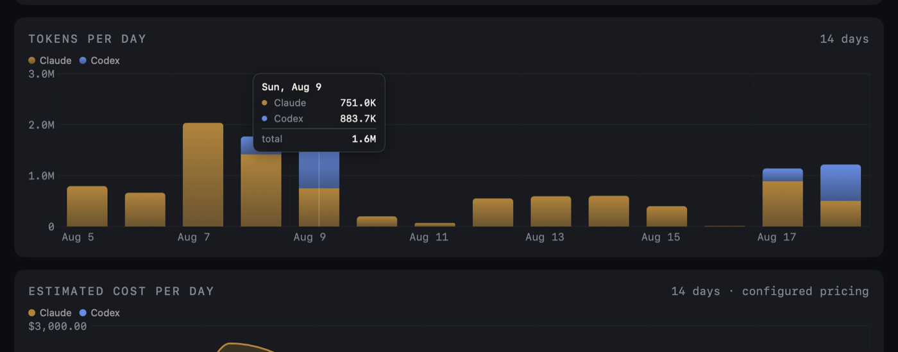

# RedLine

**Know your limit.**

RedLine is a private macOS usage monitor for Claude, Codex, and Ollama. It shows what has
been used, what remains, and when limits reset, in the menu bar and an optional desktop
widget.

**Homepage: [goriparthi.github.io/redline](https://goriparthi.github.io/redline/)**

Brand assets, tokens, and voice rules live in [brand/](brand/); `brand/BRAND.md` is the
source of truth for colour, type, and copy.

> **Not affiliated with, endorsed by, or supported by Anthropic, OpenAI, or Ollama.**

## Read this before you install

RedLine's **token and cost totals** come from transcript files those tools already write to
your disk. That part uses no API and no credentials.

RedLine's **Claude rate-limit percentages** are different. There are now two ways to get them,
and the difference between them matters.

**The usage feed asks nothing of Anthropic.** Claude Code passes its own rate-limit figures to
whatever statusline command you configure, which is a documented extension point. **Set Up
Claude Tracking** points that at a small wrapper that files them where RedLine reads them.
No credential, no Keychain, no request. If you use the feed, everything below is moot, and it
is the route this project recommends.

**The token route is the older one, and you should understand what you are opting into:**

- It reads `https://api.anthropic.com/api/oauth/usage`, which is **not a documented or
  published API**. It is an internal endpoint the Claude Code CLI uses for itself.
- Reading it needs the OAuth scope `user:profile`, which only the token Claude Code stores
  when you run `/login` carries. A token from `claude setup-token` is refused
  (`403 · does not meet scope requirement user:profile`), and Anthropic does not register
  OAuth clients for third-party apps. **Borrowing the CLI's token is the only mechanism that
  exists**, which is what `useCLIToken` does.
- **Anthropic's position is published, and it points away from this.** Since February 2026
  its authentication policy states that OAuth credentials from Claude Free, Pro, and Max plans
  are for Claude Code and Claude.ai, that products built on Claude should authenticate with a
  Console API key, and that tools misrepresenting their identity to Anthropic's servers are
  prohibited. Server-side enforcement has rejected subscription credentials outside Claude Code
  since January 2026.
- What RedLine actually does, so you can weigh it yourself: it reads the token Claude Code
  already stored on your Mac and makes one **read-only** call to the usage endpoint. It sends
  no prompts, runs no inference, and consumes none of your quota.
- **The borrowed token is read, never refreshed.** When it has expired, RedLine asks Claude
  Code to renew its own by running `claude auth status`, and that is the whole recovery. An
  earlier build went one step further and exchanged the CLI's refresh token directly;
  Anthropic rotates refresh tokens on use, so every such exchange left Claude Code holding a
  consumed token and forced a fresh `/login`. That code is deleted. When nothing will renew
  the token, RedLine shows the last reading drained to grey with its timestamp instead of a
  number pretending to be live.
- The endpoint can change, start refusing requests, or disappear without notice. It already
  rate-limits aggressively, and RedLine backs off when it does.

**You are responsible for deciding whether that is acceptable for your account**, and the
percentages stay **off until you switch them on** precisely because that decision is yours to
make rather than one to inherit from a default. If you would rather not touch it at all,
RedLine is still useful: leave `useCLIToken` false and
`oauth.clientId` empty, which is the shipped default. In that state the only request RedLine
makes is **one call a day to the GitHub releases API** to see whether a newer version exists,
and turning that off (`autoCheckUpdates`) leaves **no network requests whatsoever**. Either
way it still reports tokens, cost, model mix, and history for Claude, plus everything for
Codex and Ollama, and the usage feed still supplies the percentages.

Codex and Ollama involve no such question. Codex is read entirely from local files, and Ollama
is your own machine.

If Anthropic publishes a real usage API, this all becomes moot and RedLine will move to it.

## Screenshots


| Menu bar | Charts, on hover |
| --- | --- |
|  |  |

Widgets, one per track, configurable from the widget's own settings:

| Claude | Codex | Ollama |
| --- | --- | --- |
|  |  |  |

All three sizes carry the same reading, cut to fit rather than truncated: the medium drops
the totals, the small keeps the window nearest its limit.

| Medium | Small |
| --- | --- |
|  |  |

## What it shows

- **Usage and remaining capacity** per provider for the session and week windows, coloured by the brand thresholds (Clear, Amber, Signal).
- **How long that leaves you.** A percentage says how much is gone; RedLine also says whether
  the window runs out before it resets, and roughly when. Rails carry a marker for where the
  clock has reached, so spending faster than the window refills is visible rather than
  arithmetic.
- **Notifications, if you want them.** Off until you turn them on, and never fired from a
  stale reading.
- **The nearest limit in the menu bar**, or a provider you pick. By default the title shows
  whichever provider is closest to its limit, since that is the one that will interrupt you
  first. Choose a single provider from **Settings ▸ Menu Bar** if you would rather
  watch one. The dropdown always breaks down every provider.
- **Token and cost totals** for today, the last 5 hours, and the last 7 days, grouped under
  each provider with inline share bars, so a model can never be listed under the wrong
  provider and relative weight is visible without reading the numbers.
- **Service status**, opt-in via **Settings ▸ Check Service Status Pages**: the menu, dashboard,
  and widgets report each provider's health from its public status page (Claude and Codex), polled
  every 15 minutes. **Refresh Now** in the menu and **Check now** on the dashboard check
  immediately. All three surfaces draw the same glyph for the same state, so an outage
  reads identically wherever you happen to be looking; the dashboard keeps the wording and
  last-checked time on hover. Ollama is probed locally with no network at all; Ollama Cloud
  publishes no status feed or usage API yet, so there is nothing to read for it. Cloud
  models are marked with ☁ wherever models are listed, and the Ollama widget counts local
  and cloud separately.
- **The dashboard's theme** follows the OS, or is pinned to light or dark from the window
  itself. Every other painted surface stays on the brand's dark ground.
- **One copy at a time.** A second launch, from a second install or a build you are testing,
  opens the running copy's dashboard and exits rather than adding a second menu bar item.

## Install

Three routes. **The DMG is the one to prefer**: it is signed, notarized, and updates
itself in place from the menu, verified against this project's signing identity. Building
from source remains the strongest-trust option for anyone who wants to read what they run.

### 1. Download the DMG (recommended)

[Latest release](https://github.com/goriparthi/redline/releases/latest) → open the DMG → drag
**RedLine** to Applications → launch it. It opens normally: releases are **signed with a
Developer ID certificate and notarized by Apple**, so Gatekeeper lets them through without any
workaround. Future updates install in place from **Check for Updates…** in the menu.

### 2. Homebrew, from this repo

```sh
git clone https://github.com/goriparthi/redline.git
cd redline
brew install --cask ./Casks/redline.rb
```

### 3. From source, for source readers

```sh
git clone https://github.com/goriparthi/redline.git
cd redline
make install            # menu bar app
WIDGET=1 make install   # menu bar app and the desktop widget
```

`make install` puts the app in `~/Applications`. If you also keep a DMG install in
`/Applications`, install over it instead with `INSTALL_DIR=/Applications make install`,
so there is one bundle rather than two competing for the menu bar.

Needs Xcode for the widget; the menu bar app alone builds with the Command Line Tools. You
end up running a binary you compiled from source you can read. Updates are `git pull &&
make install`, not automatic.

### Verifying a download

Verifying is still worth a moment, and here it actually tells you something:

```sh
spctl -a -vvv -t install /Applications/Redline.app
#   expect: accepted, source=Notarized Developer ID

codesign -dv --verbose=2 /Applications/Redline.app
#   expect: Authority=Developer ID Application: Prashanth Goriparthi (QX3NQYWX6F)
```

If macOS ever *does* block a build of this app, treat that as a signal something is wrong with
the download rather than something to work around. The command that strips the quarantine flag
is easy to find, and it is the same step malware distributors ask victims to perform, so
reserve it for software you have actually verified. Building from source remains the only route
where you can read what you are about to run.

### Which providers to read

On first launch RedLine asks which of Claude, Codex, and Ollama to read, listing only what it
finds installed. Change it later from **Settings ▸ Set Up RedLine…**, which
reopens the same window.

RedLine works with any one of them. With a single tool installed the provider pickers
disappear, since there is nothing to choose between.

### Updates

RedLine asks the GitHub releases API **once a day** whether a newer version exists, and says
nothing unless one does; a quiet check never interrupts. This is on by default and is the
only request RedLine makes without being asked. An app that installs updates in place has to
learn about them to be worth trusting, and a security fix nobody hears about is not a fix.
Turn it off with **Settings ▸ Updates ▸ Check Daily** and RedLine goes back to making
no network requests at all; **Check for Updates…** then checks on demand, whenever you ask.

When a newer release exists, **Install Update…** replaces the app in place: it downloads the
DMG, verifies it is notarized and signed by this project's Developer ID team (anything else
is refused), then quits, swaps the bundle, and relaunches. That self-swap exists because
nothing else can do it: dragging a new DMG over a running install fails with
"RedLine.app is in use", since the menu bar app and the widget hold the old bundle. If you
prefer the manual route, quit RedLine first and the drag works.

Installed with Homebrew? `brew upgrade --cask redline`. Built from source? `git pull &&
make install`.

### Beta channel

Prerelease builds (versions like `0.5.0-beta.1`) ship as GitHub prereleases, which the
stable channel never sees: `releases/latest` excludes them by definition, so the daily
check and the `redline` cask stay on full releases. Opt in with
**Settings ▸ Updates ▸ Beta Releases**, which rechecks immediately, or set
`"updateChannel": "beta"` in `~/.config/redline/config.json`. Homebrew has its own channel:

```bash
brew install --cask ./Casks/redline-beta.rb
```

The beta channel offers whichever version is newest, so a stable release still reaches
beta users the moment it outranks the last prerelease. Picking **Stable Releases** again
leaves the running beta in place until a stable release outranks it.

Betas exist to become stable, so `scripts/release.sh` will not cut an unbounded run of
them: after 3 prereleases on one version, or 14 days since its first, the next release has
to be the promotion. Stable releases are gated the other way, and never ship a version that
saw no beta at all. `GATE_ANYWAY=1` overrides both for a hotfix that cannot wait.

### Uninstalling

**Uninstall RedLine…** at the bottom of the dropdown moves the app to the Trash and removes
the login item and its Keychain token, with an optional tick to delete settings, logs and
history as well. Your Claude, Codex and Ollama files are never touched. From a clone,
`make uninstall` and `make purge` do the same thing, and a Homebrew install is removed with
`brew uninstall --cask redline`.

## Providers

Pick which ones to read from **Settings ▸ Set Up RedLine…**, or set `providers`
in the config. Each is independent; none is required.

| Provider | Source | Auth | Rate limits | Tokens |
| --- | --- | --- | --- | --- |
| Claude | `~/.claude/projects/**/*.jsonl` | none for tokens; see below for limits | yes, via API | yes |
| Codex | `~/.codex/sessions/**/*.jsonl` | none | yes, from disk | yes |
| Ollama | `~/.local/share/redline/ollama.jsonl` | none | n/a | yes, via shim |

### What works immediately, and what needs a decision

Out of the box, with no configuration:

| Works now | Needs you to opt in |
| --- | --- |
| Claude tokens, cost, model mix, history | Claude session and week percentages |
| Codex limits, tokens, history | |
| Ollama models, status, volume | |

The percentages are the only part that can need the undocumented endpoint described above,
and the usage feed supplies them without it.

### Claude rate limits: the feed, or a token

Token and cost totals come from transcripts on disk and need no credentials. The
**rate-limit percentages** have three routes, and the first one needs no credential either.

**1. The usage feed (recommended).** Claude Code hands its own rate-limit figures to whatever
statusline command you have configured. **Set Up Claude Tracking** in the menu points that
at a small wrapper which files those figures where RedLine reads them. No token, no Keychain
prompt, and no request to Anthropic. It keeps any statusline you already run: yours still
draws the line, unchanged, and the wrapper only takes a copy of the limit block in passing.

The figures update while Claude Code is running. Between sessions every surface drains them
to grey and shows when they were captured in amber, rather than pretending they are live, and
a window that has already reset is dropped instead of reported. If another Claude Code
session overwrites `settings.json` and unwires the feed (saving a model choice from a session
that predates the install is enough), RedLine notices on its next poll and re-wires it,
keeping whatever statusline command is there chained in front.

The remaining two routes are for when the feed is not installed or your build of Claude Code
does not send the limits. Both live in **Settings ▸ Set Up RedLine…**, and both are
off by default:

**2. Borrow the CLI's token** (`useCLIToken: true`). Needs Claude Code installed and signed
in. Off by default, because that credential belongs to another application and reading it
should never be a silent default. RedLine looks for it in `~/.claude/.credentials.json`
first, then via the Apple-signed `security` tool, which the item's own partition already
trusts and which therefore usually reads with no prompt at all; the Keychain API, the one
path that does prompt, is tried last. If macOS does ask, click **Always Allow**.

When that token expires, RedLine asks Claude Code to renew its own by running
`claude auth status`, which keeps a single refresh chain and cannot disturb your CLI login.
That is the whole recovery: the refresh token is never spent, so borrowing cannot sign the
CLI out. Until the CLI renews, the last percentages are shown drained to grey with their
timestamp.

**3. Sign in with your Claude account in a browser.** The PKCE flow is complete and the
   `user:profile` scope it requests is accepted by the usage endpoint, so the route works the
   moment a client id is set (`oauth.clientId`). What this project will not do is ship one:
   **Anthropic does not register OAuth clients for third-party applications**, and presenting
   Claude Code's id would misrepresent RedLine as another application, which their policy
   prohibits. If you configure an id on your own machine anyway, that decision, and whose id
   it is, is yours. The grant lives in RedLine's own Keychain item on its own refresh chain,
   so whatever happens to it, your CLI login is untouched.

Chat-only users get percentages but no token or cost tables, since those are read from
Claude Code's transcripts and there are none to read.

### The two permission prompts, explained

- **"RedLine would like to access data from other apps"**: reading Claude Code's and
  Codex's transcript files is the product, and this is macOS asking you to approve exactly
  that. One **Allow** should hold. If it reappears on every launch, you are probably running
  a translocated copy (launched straight from the DMG or Downloads); move RedLine.app to
  Applications with Finder and launch it from there. For a grant that macOS remembers
  unconditionally, give RedLine **Full Disk Access** in System Settings; **Stop Permission
  Prompts…** under Settings takes you there, and the item disappears once it is granted. It is
  a broad permission, and RedLine still reads only what this document and SECURITY.md list.
- **The Keychain prompt** for `Claude Code-credentials` appears only with `useCLIToken` on,
  and it should now be rare: reads go through the Apple-signed `security` tool first, which
  the item's own partition trusts, so the prompting API call runs only when that quiet path
  fails. If macOS does ask, **Always Allow** is the answer to give; plain Allow grants a
  single read, so the prompt returns. In practice even Always Allow has been observed not to
  survive Claude Code rewriting its item, which is exactly why the read order changed and why
  every other tool that reads this credential does the same. If you still see
  **Reconnect Claude usage…** it means something specific, and the menu says which: the CLI is
  signed out, the Keychain refused the read, or the token is expired and waiting on Claude
  Code to renew it.

  The surest way to never see the prompt at all is the usage feed, which reads no credential.

If neither is available the menu bar shows `sign in` rather than a number. It deliberately
never falls back to showing token counts in the limits slot, because a plausible-looking
number in that position reads as real limit data.

### Ollama needs one setup step

Ollama keeps no usage history, so there is nothing to read retroactively. **Settings ▸ Set Up Ollama
Tracking…** installs a transparent shim at `~/.local/bin/ollama`, ahead of
the real binary on your `PATH`. After that, plain `ollama run` is counted with no habit
change, whether you type it or a coding agent does:

```sh
ollama run qwen3-coder:30b <<'PROMPT'
Summarize this build log.
PROMPT
```

The shim passes every subcommand through to the real binary untouched. Only two shapes are
intercepted and answered over the local API so the counts can be recorded: `ollama run MODEL`
with a piped prompt, and `ollama run MODEL "prompt"`. Interactive chat, flags, and everything
else behave exactly as without it, and if the API call fails the prompt is replayed through
the real binary, so the worst case is an uncounted call, never a broken one.

Honest limits: programs that call Ollama's HTTP API directly never touch the CLI, so the
shim cannot see them, and interactive chat sessions are passed through uncounted. Local
inference has no dollar cost, so shim entries are counted as tokens and left out of spend
on purpose.

The menu item appears only when Ollama is installed, re-running it updates an older copy,
and it refuses to overwrite a file it did not create. From a clone, `scripts/ollama-shim.sh`
is the same script.

## Configuration

`~/.config/redline/config.json`, written with defaults on first launch. Reloaded on every
poll, so edits apply without a restart. **Settings ▸ Edit Config…** opens it.

| Key | Default | Meaning |
| --- | --- | --- |
| `pollIntervalSeconds` | 300 | Refresh interval, minimum 10 |
| `menuBarDisplay` | `limits` | `limits`, `cost`, `tokens`, `both`, `session` |
| `limitYellowPct` / `limitRedPct` | 60 / 85 | Color thresholds |
| `providers` | all three | Which sources to read |
| `useCLIToken` | `false` | Read the Claude CLI's Keychain token instead of signing in |
| `menuBarProvider` | `auto` | Which provider the menu bar reports: `auto`, `Claude`, `Codex`, `Ollama` |
| `showMenuIcon` | `true` | The mark in the menu bar; off leaves just the numbers |
| `showResetTimes` | `true` | Reset times in the menu bar and dropdown |
| `limitWindows` | `all` | Which limit windows to report: `all`, `session`, `week` |
| `autoCheckUpdates` | `true` | Ask once a day whether a newer release exists; speaks up only when one does |
| `statusChecks` | `false` | Poll the providers' public status pages every 15 minutes |
| `dashboardTheme` | `auto` | Dashboard appearance: `auto` follows the OS, or force `light` or `dark` |
| `alerts` | `true` | Notify when a window crosses a threshold, is about to run out, or resets |
| `recordHistory` | `true` | Keep a daily rollup so history outlives Claude Code's transcript cleanup |
| `publishSidecar` | `true` | Write the current windows where other local tools can read them |
| `externalUsagePath` | empty | Absolute path to another tool's usage sidecar, read as a fallback |
| `findingsScans` | `true` | Look through transcripts for setup findings in the background |
| `mindfulCues` | `true` | Say when a run has gone long, when you are still going late, and when days have run together |
| `stretchMinutes` | `90` | How long an unbroken run reaches before it is worth saying |
| `lateHour` | `23` | The local hour after which activity counts as late |
| `streakDays` | `7` | How many consecutive days with activity before that is worth saying |
| `agentFleet` | `true` | List the Claude Code sessions running on this Mac, and mark the menu bar when one is waiting on you |
| `pricingPerMTok` | see below | USD per million tokens, matched by substring of model name |
| `oauth.clientId` | empty | Required for the app's own Sign In, which Anthropic does not issue to third-party apps |

Pricing keys match by substring, so `opus` covers `claude-opus-5`. A model with no matching
key is **counted but excluded from cost**, and the dropdown marks the total with `+`.
Guessing a price tier would silently misreport spend, so it does not.

## Development

```sh
make help       # list targets
make test       # 249 unit tests
make e2e        # 46 end to end checks against the built binary
make ci         # everything CI runs, in the same order
make build      # release binary
make bundle     # dist/Redline.app, signed
make widget     # app + desktop widget via Xcode
make dmg        # dist/Redline-<version>.dmg
make notes      # this version's release notes are written and readable
make uninstall  # remove app, LaunchAgent and Keychain token
make purge      # the same, and delete config, logs and history
```

The checks come in two layers. The unit tests pin the parsing, the merge rules and the
alerting decisions. The end to end suite writes fixture transcripts into a throwaway home,
runs the real binary against them, and asserts on its output and exit codes: that a second
ingest reads nothing new, that a half-written line is not parsed until it is whole, that the
recorded totals survive the transcripts being deleted, and that a provider left out of the
config is not read at all.

`REDLINE_HOME` points the whole app at a different directory, which is how the end to end
suite runs without seeing or touching your own usage data. It is honoured only when it names
an absolute path that already exists.

CI is `scripts/ci.sh`, and the workflow in `.github/workflows/ci.yml` only decides when to
call it. Everything it runs is in this repo and runs the same way on a laptop: a red build
is reproduced with `make ci`, not by pushing another commit.

Every release carries written notes at `notes/releases/<version>.md`: a summary line,
titled sections, prose a person can act on. `make notes` checks the shape, CI checks it on
every push, and `scripts/release.sh` refuses to publish without it. There is no fallback to
a generated commit list, because a release body that lists commits tells nobody whether the
build is worth installing.

Tests need XCTest, which ships with Xcode rather than the Command Line Tools.
`scripts/test.sh` finds a usable Xcode automatically, so no `sudo xcode-select` is needed.

See [docs/ARCHITECTURE.md](docs/ARCHITECTURE.md) for the layout,
[docs/EXTENDING.md](docs/EXTENDING.md) for how to add a provider,
[docs/DEPLOY.md](docs/DEPLOY.md) for cutting and publishing a release, and
[docs/SIGNING.md](docs/SIGNING.md) for signing and notarizing.

## Usage dashboard

**Open Usage Dashboard…** (⌘D) in the menu, or just double-click `Redline.app`, opens a native
window with charts built from the same data the menu bar summarises:

- a provider dropdown: all of them at once, or focus one
- tokens per day by provider, over 7, 14, or 30 days
- estimated cost per day, over the same range
- the last 24 hours, hour by hour
- the model mix, with unpriced models shown as `—` rather than `$0.00`
- current limit rails, each ending at its threshold, with time to limit and a pace marker
- setup findings, and what the local history holds

Every chart answers the value question on hover: point at a day or an hour and a readout
names each provider's figure for that bucket and the total, snapped to the nearest bucket so
the gap between two bars is still answerable.

The 7, 14 and 30 day buttons drive every panel and both totals tiles, not just the charts, so
a figure on this window always describes the range named next to it.

Focusing **Ollama** adds a control panel: server status and version, models loaded in memory
with their size and how much sits on the GPU, every downloaded model, and Start / Stop for
each. Stop unloads from memory with `keep_alive: 0`; it never deletes a download, and nothing
in RedLine removes model weights.

The charts need no extra recording: transcript entries already carry timestamps, so the range
is derived from files already on disk. A 30 day scan touches a lot of them, so it runs off the
main thread with a progress state. What is on disk is not forever, though, which is what
**Recorded history** below the charts is for.

## Pace, and when it runs out

A percentage tells you how much of a window is gone. It does not tell you the thing you
actually want to know, which is whether it will stop you before it rolls over. Every window
that has run long enough now carries a rate, and the menu, the rails and the CLI say what
that rate implies:

    Session (5h): 62%  resets in 2h 10m
        ~48m to limit, 1h 22m before reset

Two rates are possible and they are not equally good. When readings have been recorded inside
the same window instance, the rate is measured by differencing them, which catches a burst
that started twenty minutes ago. Otherwise it is the window's own average since it opened,
which is always available and blind to exactly that. The tooltip says which one you are
looking at, and neither is ever computed from a stale reading.

The rails carry a thin marker showing how far through the window the clock has got. Fill
level with the marker is a window being spent exactly as fast as it refills; fill ahead of it
runs out early.

### Notifications

**Settings ▸ Notify at Thresholds** is off until you switch it on, and switching it on is
when macOS is asked for permission. Then RedLine speaks up when a window crosses your amber
or signal percentage, when the projection says it will run out before it resets, when it
reaches the cap, and when it rolls over and capacity comes back.

Each of those fires once per window instance, so a window that sits at 86% for an hour is one
notification rather than twelve, and a fresh window re-arms them. A stale reading never fires
anything: RedLine would rather say nothing than interrupt you over a percentage it cannot
vouch for.

## Setup findings

The dashboard's **Findings** panel reports what your transcripts say about how Claude Code is
configured, as opposed to how much it cost:

- MCP servers configured but never called, which pay for their tool schemas in every session
  that loads them
- skills, agents and slash commands defined under `~/.claude` and never invoked
- files read three or more times inside a single session
- memory files (`CLAUDE.md` and everything it imports) large enough to be worth knowing about

Each finding says whether its numbers were **counted** from the transcripts or **estimated**
through an assumption, and the assumption is written out where it is used. **A finding with
nothing honest to put on it carries no dollar figure at all**: the schema overhead of an
unused MCP server is real and is not visible from here, so no number is invented for it. Token
estimates divide measured characters by four; costs price measured session counts at the
model's own rate. They are a signal, not a bill.

The scan runs in the background at most every six hours, because setup changes at the speed of
someone editing a config file. `redline findings` runs it on demand, and **Scan again** in the
panel does the same. Nothing is read except `~/.claude` and the `CLAUDE.md` of projects your
own transcripts name, no file content is copied anywhere, and the report lives in memory.

## Local history

Claude Code prunes its own transcripts, so a window built from what is still on disk gets
quietly shallower every week, and there is no way to go back for it later. RedLine keeps its
own copy in a SQLite database at `~/.local/share/redline/history/redline.db`, using the
`libsqlite3` macOS already ships, so the app carries no database of its own.

Four tables. `entries` is one row per usage record, deduped on the provider's message id
where there is one and on the transcript position where there is not, kept for a year.
`daily` is the rollup, one row per UTC day, provider and model, kept forever. `limit_samples`
is every limit reading, kept 60 days, and is what the measured burn rate is differenced from.
`ingest_state` records how far into each transcript has already been read.

Two rules matter. **A day already recorded never shrinks**: entries age out on retention long
before the rollup does, and a rollup recomputed after that is not allowed to write the day
back down. And **each transcript is read once**: RedLine records the byte offset it stopped
at and reads only what has been appended since, so a quiet poll costs a directory walk rather
than a parse of every byte on the disk. A file that is truncated or rewritten shorter is read
again from the start, because the offsets no longer point where they did.

It is `0600`, a few megabytes, and **Keep Local History** turns it off. `redline history
--csv` exports it, `redline ingest` reads new records on demand, and any SQLite client can
open the file if you want to ask it something this app does not.

## Cadence

**Settings ▸ Say How the Day Is Going** reports three things counted from timestamps: a run
of activity that has gone past `stretchMinutes` with no break longer than 15 minutes, activity
still happening after `lateHour`, and `streakDays` consecutive days with usage. Each is said
once, at the threshold and again at multiples of it, never per poll.

It is off by default and it stays descriptive on purpose. RedLine can see the keyboard and
cannot see the person at it, so nothing here infers tiredness or wellbeing and nothing here
gives advice; a cue states what was counted and stops. A cue can only fire when there is
recent activity, so a machine nobody is using is silent without needing a quiet hours setting.
`redline cadence` asks the same questions on demand, and the dashboard draws the hour of day
shape next to the recorded history.

## The usage sidecar, and the command line

Three other projects in this space (ClaudeHUD, claude-monitor, CodexBar) each landed on the
same idea: one small JSON file holding the current windows, written by whoever has them and
read by whoever needs them. RedLine already read that shape. Now it writes it too, to
`~/.local/share/redline/usage-snapshot.json`, so a status line, a tmux strip or another
monitor can take this reading rather than every tool racing for the same source. Standard keys
first, with anything RedLine-specific under a `redline` object a foreign reader can ignore.

It reads someone else's too. Point `externalUsagePath` at an absolute path to another tool's
sidecar and it becomes a fallback for when RedLine's own feed is quiet. It is used only while
it is fresh, because a file another tool stopped updating misleads exactly as much as one of
ours would.

The app bundle carries a CLI at `Redline.app/Contents/MacOS/redline`, worth a symlink:

```sh
ln -s /Applications/Redline.app/Contents/MacOS/redline ~/.local/bin/redline

redline status              # windows, pace, today and this week
redline status --json       # the same, with every figure labelled by provenance
redline findings --days 14  # the setup checks
redline history --csv       # the local store, as CSV
redline cadence             # runs, hours and days in a row
redline ingest              # read new transcript records in now
```

Exit codes are part of the contract, so a script never has to parse prose: `0` fine, `10` near
a limit, `11` at a limit, `20` nothing to report, `30` no data. The tool fetches nothing; it
reads what the app already published, and says how old that is.

## Desktop widget

`make widget` builds the app with a WidgetKit extension you can drop on the desktop or in
Notification Centre. It shows the worst session and week gauges, and on the large size the
token and cost totals.

The widget renders a snapshot the menu bar app writes into the widget extension's own
container. It never parses transcripts itself, because a widget process has a hard time and
memory budget. Two consequences worth knowing:

- **It is not live.** WidgetKit decides when to reload. The view labels itself stale when
  the snapshot is over 15 minutes old rather than implying the number is current.
- **If the menu bar app is not running, the snapshot goes stale** and the widget says so.

Install it with `WIDGET=1 make install`, then add RedLine from the desktop widget gallery.

The widget is **configurable**: right-click it, choose **Edit Widget**, and pick a track. Add
it more than once to watch several at the same time, for example one for Claude, one for
Codex, and one for Ollama.

| Track | Shows |
| --- | --- |
| All providers | Session and week for whichever provider is nearest its limit, plus totals |
| Claude | Claude's own windows, tokens and estimated cost |
| Codex | Codex's own windows, tokens and estimated cost |
| Ollama | Server status and version, models loaded with how much sits on the GPU, models downloaded and their size on disk |

On the all-providers track the large size adds a per-window breakdown; a single-provider
track leaves it out, since it would only repeat the gauges above it. Every size ends with
the provider's health and, when the reading is old, how old. Ollama state travels in the
snapshot rather than
being fetched by the widget, so the extension needs no network access of its own.

No Apple ID is needed to run it locally: the build ad-hoc signs the bundle, which macOS
accepts on this machine. There is no App Group, because a capability entitlement needs a
provisioning profile and that would make the build unnotarizable. Distributing the widget to
anyone else does require a Developer ID Application certificate, and the build switches to
real signing automatically once one exists.

## Site

`site/index.html` is a single self-contained page, deployed to GitHub Pages by
`.github/workflows/pages.yml` on any push that touches it.

The project homepage is at https://goriparthi.github.io/redline/.

## Track badges

Each provider carries an original badge and colour, used identically in the menu, the dashboard
and the widgets: a ring and satellite for Claude (a hosted endpoint), chevrons for Codex
(source code), stacked bars for Ollama (weights held locally), and the RedLine mark for all
providers at once.

These are deliberately **not** vendor logos. Anthropic, OpenAI and Ollama all restrict
third-party use of their marks, and a traced approximation would breach the requirement that a
mark be reproduced unaltered.

## Security

[SECURITY.md](SECURITY.md) lists every path RedLine reads and writes, the four Anthropic
hosts it can reach, and how credentials are handled. In short: transcripts are parsed for
token counts and never copied or transmitted, there is no telemetry, the usage feed writes
only the rate-limit block and discards the rest of the payload, and reading the Claude CLI's
credential is opt-in.

## Disclaimer

There is no Terms of Service here, and none is needed: RedLine is not a service. Nothing is
hosted, no account is created, and no data leaves your Mac except the optional Claude
rate-limit call. The **MIT licence is the governing document**, and it already disclaims
warranty and liability in the usual terms.

In plain language:

- **No warranty.** This is provided as-is. If it misreports something, you carry the outcome.
- **Costs are estimates**, computed from a pricing table you can edit. They are not a bill and
  will not match your invoice. Treat them as a signal, not an accounting record.
- **Your account is your responsibility.** Claude rate-limit percentages come from an
  undocumented endpoint, described at the top of this file. Whether using it is acceptable
  under Anthropic's terms is a decision only you can make for your own account.
- **Built with heavy AI assistance.** Most of this code was written by an AI agent working
  with the author. It is reviewed, tested, and shipped deliberately, and the author is
  responsible for what it does. AI involvement is disclosed because you deserve to know how
  something you run was made, not as an excuse: "an AI wrote it" would not transfer risk to
  you, and the MIT warranty disclaimer is what actually governs liability.

If you find something wrong, please open an issue.

## License

Code is MIT. See [LICENSE](LICENSE).

The contents of `brand/` (the mark, wordmark, app icon, and colour tokens) are original
artwork for this project and are **not** covered by the MIT grant. Fork the code freely; please
use your own name and mark rather than shipping something that looks like RedLine.

Track badges in the UI are original iconography, deliberately not vendor logos. Anthropic,
OpenAI, and Ollama all restrict third-party use of their marks.
