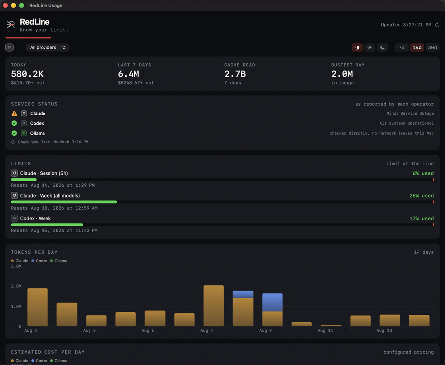
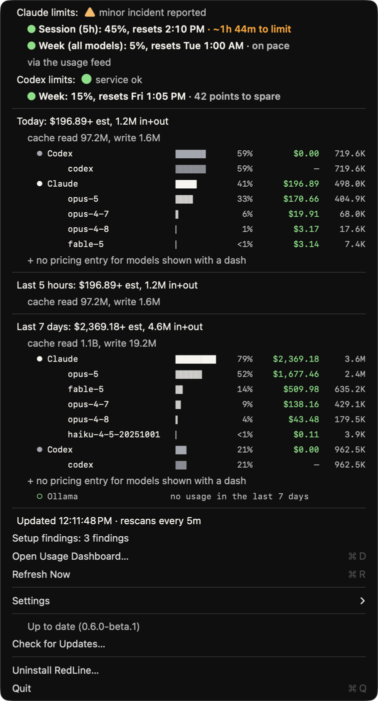
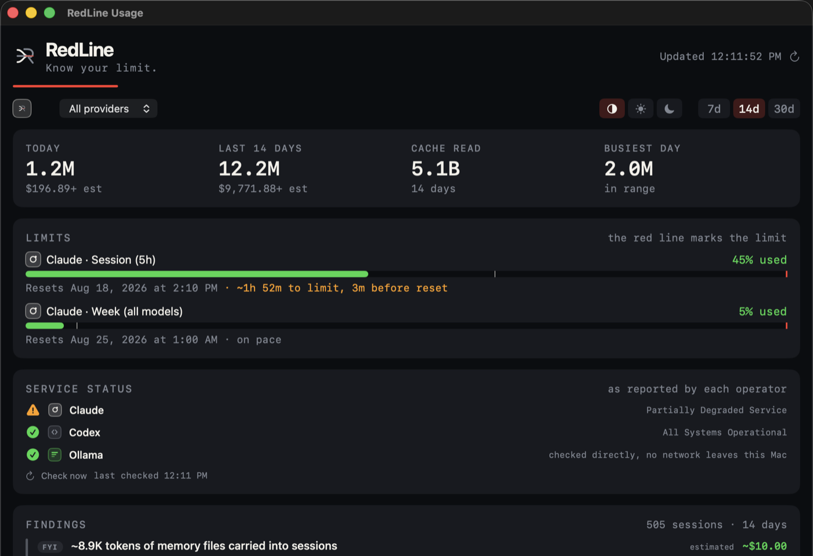
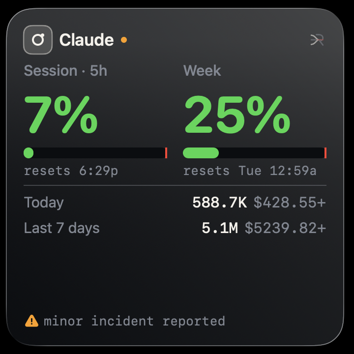
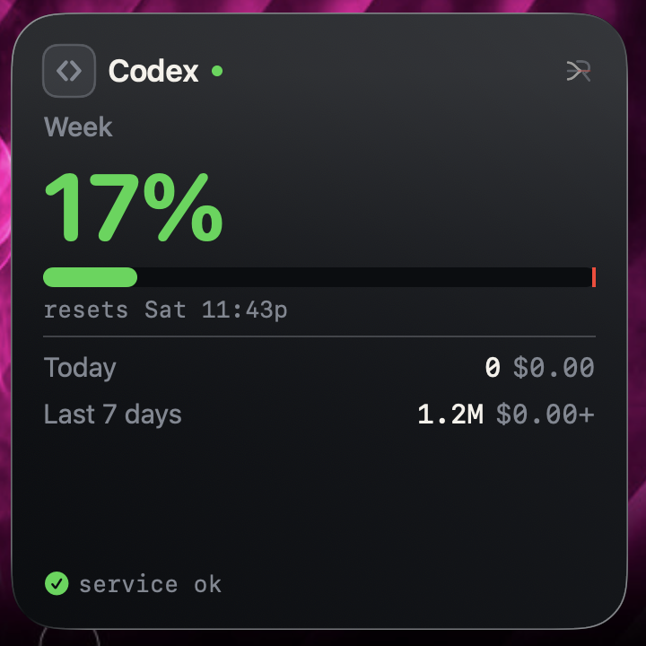
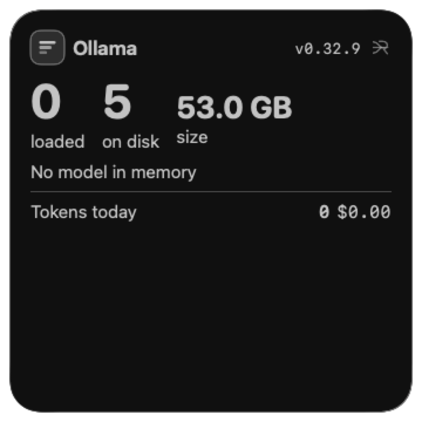
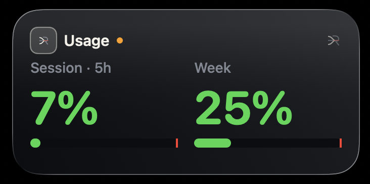
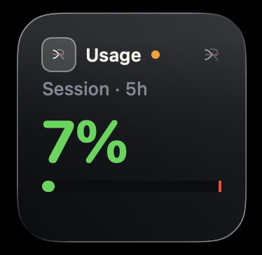

# RedLine

**Know your limit.**

RedLine is a private macOS usage monitor for Claude, Codex, and Ollama. It shows what has
been used, what remains, and when limits reset, in the menu bar and an optional desktop
widget.

**Homepage: [goriparthi.github.io/redline](https://goriparthi.github.io/redline/)**

Brand assets, tokens, and voice rules live in [brand/](brand/); `brand/BRAND.md` is the
source of truth for colour, type, and copy.

> **Not affiliated with, endorsed by, or supported by Anthropic, OpenAI, or Ollama.**

## Read this before you install

RedLine's **token and cost totals** come from transcript files those tools already write to
your disk. That part uses no API and no credentials.

RedLine's **Claude rate-limit percentages** are different, and you should understand what you
are opting into:

- They come from `https://api.anthropic.com/api/oauth/usage`, which is **not a documented or
  published API**. It is an internal endpoint the Claude Code CLI uses for itself.
- Because it is undocumented, **there is no published permission to use it**. Doing so may fall
  outside Anthropic's Terms of Service or acceptable use policy. Nobody here has a ruling
  either way, and this project is not in a position to give you one.
- Reading the Claude CLI's stored OAuth token (`useCLIToken`, off by default) means using
  **your own credential** in a way Anthropic has not documented or endorsed.
- The endpoint can change, start refusing requests, or disappear without notice. It already
  rate-limits aggressively, and RedLine backs off when it does.

**You are responsible for deciding whether that is acceptable for your account.** If you would
rather not touch it at all, RedLine is still useful: leave `useCLIToken` false and
`oauth.clientId` empty, which is the shipped default. In that state RedLine makes **no network
requests whatsoever** and still reports tokens, cost, model mix, and history for Claude, plus
everything for Codex and Ollama. You lose only the Claude percentages.

Codex and Ollama involve no such question. Codex is read entirely from local files, and Ollama
is your own machine.

If Anthropic publishes a real usage API, this all becomes moot and RedLine will move to it.

## Screenshots



| Menu bar | Dashboard |
| --- | --- |
|  |  |

Widgets, one per track, configurable from the widget's own settings:

| Claude | Codex | Ollama |
| --- | --- | --- |
|  |  |  |

All three sizes carry the same reading, cut to fit rather than truncated: the medium drops
the totals, the small keeps the window nearest its limit.

| Medium | Small |
| --- | --- |
|  |  |

## What it shows

- **Usage and remaining capacity** per provider for the session and week windows, coloured by the brand thresholds (Clear, Amber, Signal).
- **The nearest limit in the menu bar**, or a provider you pick. By default the title shows
  whichever provider is closest to its limit, since that is the one that will interrupt you
  first. Choose a single provider from **Settings ▸ Menu Bar Shows** if you would rather
  watch one. The dropdown always breaks down every provider.
- **Token and cost totals** for today, the last 5 hours, and the last 7 days, grouped under
  each provider with inline share bars, so a model can never be listed under the wrong
  provider and relative weight is visible without reading the numbers.
- **Service status**, opt-in via **Settings ▸ Show Service Status**: the menu, dashboard,
  and widgets report each provider's health from its public status page (Claude and Codex), polled
  every 15 minutes. **Refresh Now** in the menu and **Check now** on the dashboard check
  immediately. All three surfaces draw the same glyph for the same state, so an outage
  reads identically wherever you happen to be looking; the dashboard keeps the wording and
  last-checked time on hover. Ollama is probed locally with no network at all; Ollama Cloud
  publishes no status feed or usage API yet, so there is nothing to read for it. Cloud
  models are marked with ☁ wherever models are listed, and the Ollama widget counts local
  and cloud separately.
- **The dashboard's theme** follows the OS, or is pinned to light or dark from the window
  itself. Every other painted surface stays on the brand's dark ground.
- **One copy at a time.** A second launch, from a second install or a build you are testing,
  opens the running copy's dashboard and exits rather than adding a second menu bar item.

## Install

Three routes. **The DMG is the one to prefer**: it is signed, notarized, and updates
itself in place from the menu, verified against this project's signing identity. Building
from source remains the strongest-trust option for anyone who wants to read what they run.

### 1. Download the DMG (recommended)

[Latest release](https://github.com/goriparthi/redline/releases/latest) → open the DMG → drag
**RedLine** to Applications → launch it. It opens normally: releases are **signed with a
Developer ID certificate and notarized by Apple**, so Gatekeeper lets them through without any
workaround. Future updates install in place from **Check for Updates…** in the menu.

### 2. Homebrew, from this repo

```sh
git clone https://github.com/goriparthi/redline.git
cd redline
brew install --cask ./Casks/redline.rb
```

### 3. From source, for source readers

```sh
git clone https://github.com/goriparthi/redline.git
cd redline
make install            # menu bar app
WIDGET=1 make install   # menu bar app and the desktop widget
```

`make install` puts the app in `~/Applications`. If you also keep a DMG install in
`/Applications`, install over it instead with `INSTALL_DIR=/Applications make install`,
so there is one bundle rather than two competing for the menu bar.

Needs Xcode for the widget; the menu bar app alone builds with the Command Line Tools. You
end up running a binary you compiled from source you can read. Updates are `git pull &&
make install`, not automatic.

### Verifying a download

Verifying is still worth a moment, and here it actually tells you something:

```sh
spctl -a -vvv -t install /Applications/Redline.app
#   expect: accepted, source=Notarized Developer ID

codesign -dv --verbose=2 /Applications/Redline.app
#   expect: Authority=Developer ID Application: Prashanth Goriparthi (QX3NQYWX6F)
```

If macOS ever *does* block a build of this app, treat that as a signal something is wrong with
the download rather than something to work around. The command that strips the quarantine flag
is easy to find, and it is the same step malware distributors ask victims to perform, so
reserve it for software you have actually verified. Building from source remains the only route
where you can read what you are about to run.

### Which providers to read

On first launch RedLine asks which of Claude, Codex, and Ollama to read, listing only what it
finds installed. Change it later from **Settings ▸ Providers & Claude Limits…**, which
reopens the same window.

RedLine works with any one of them. With a single tool installed the provider pickers
disappear, since there is nothing to choose between.

### Updates

**Check for Updates…** in the menu compares your version against the latest release. It runs
only when you ask, because an unasked background poll would break the promise that RedLine
makes no network requests you did not opt into. **Settings ▸ Check for Updates Twice a
Day** is that opt-in: enabled, RedLine polls the GitHub releases API every 12 hours and
pops up only when an update actually exists; a quiet check never interrupts.

When a newer release exists, **Install Update…** replaces the app in place: it downloads the
DMG, verifies it is notarized and signed by this project's Developer ID team (anything else
is refused), then quits, swaps the bundle, and relaunches. That self-swap exists because
nothing else can do it: dragging a new DMG over a running install fails with
"RedLine.app is in use", since the menu bar app and the widget hold the old bundle. If you
prefer the manual route, quit RedLine first and the drag works.

Installed with Homebrew? `brew upgrade --cask redline`. Built from source? `git pull &&
make install`.

### Uninstalling

**Uninstall RedLine…** at the bottom of the dropdown moves the app to the Trash and removes
the login item and its Keychain token, with an optional tick to delete settings, logs and
history as well. Your Claude, Codex and Ollama files are never touched. From a clone,
`make uninstall` and `make purge` do the same thing, and a Homebrew install is removed with
`brew uninstall --cask redline`.

## Providers

Pick which ones to read from **Settings ▸ Providers & Claude Limits…**, or set `providers`
in the config. Each is independent; none is required.

| Provider | Source | Auth | Rate limits | Tokens |
| --- | --- | --- | --- | --- |
| Claude | `~/.claude/projects/**/*.jsonl` | none for tokens; see below for limits | yes, via API | yes |
| Codex | `~/.codex/sessions/**/*.jsonl` | none | yes, from disk | yes |
| Ollama | `~/.local/share/redline/ollama.jsonl` | none | n/a | yes, via shim |

### What works immediately, and what needs a decision

Out of the box, with no configuration:

| Works now | Needs you to opt in |
| --- | --- |
| Claude tokens, cost, model mix, history | Claude session and week percentages |
| Codex limits, tokens, history | |
| Ollama models, status, volume | |

The percentages are the only part that needs the undocumented endpoint described above.

### Claude rate limits need a token

Token and cost totals come from transcripts on disk and need no credentials. The
**rate-limit percentages** come from an undocumented endpoint that requires an OAuth token.
Both routes live in **Settings ▸ Providers & Claude Limits…**, and both are off by default:

1. **Borrow the CLI's token** (`useCLIToken: true`). Needs Claude Code installed and signed
   in. Off by default, because that Keychain item belongs to another application and reading
   it should never be a silent default. When macOS asks, click **Always Allow**: plain Allow
   grants a single read and the prompt returns on the next refresh. If you denied it, or the
   app runs as a background agent that is refused silently, grant it in Keychain Access.app:
   find `Claude Code-credentials`, open **Access Control**, and add `Redline.app`.
2. **Sign in with your Claude account in a browser.** This is the route for people who use
   the claude.ai app or website rather than Claude Code: the percentages cover the whole
   account, so they work with no transcripts on disk at all. It requires an OAuth client id
   (`oauth.clientId`, or paste it into the setup window). **No client id ships by default**,
   because this project is not registered with Anthropic and shipping someone else's client
   id is not ours to do.

Chat-only users get percentages but no token or cost tables, since those are read from
Claude Code's transcripts and there are none to read.

### The two permission prompts, explained

- **"RedLine would like to access data from other apps"**: reading Claude Code's and
  Codex's transcript files is the product, and this is macOS asking you to approve exactly
  that. One **Allow** should hold. If it reappears on every launch, you are probably running
  a translocated copy (launched straight from the DMG or Downloads); move RedLine.app to
  Applications with Finder and launch it from there. For a grant that macOS remembers
  unconditionally, give RedLine **Full Disk Access** in System Settings; **Stop Permission
  Prompts…** under Settings takes you there, and the item disappears once it is granted. It is
  a broad permission, and RedLine still reads only what this document and SECURITY.md list.
- **The Keychain prompt** for `Claude Code-credentials` appears only with `useCLIToken` on,
  and **Always Allow** is the answer to give. Be aware of what it does and does not buy you,
  because this is inherent to borrowing another app's credential: **the grant lasts until
  Claude Code next writes that item**, which it does whenever it refreshes its token, not
  only when you sign in again. The rewritten item no longer lists RedLine, so the
  percentages stop and the menu bar reads **Connect** until you allow it once more. You may
  well find this waiting for you in the morning, since a refresh often lands overnight.
  RedLine cannot hold the grant open: the item belongs to Claude Code, and only its owner
  decides who may read it. What RedLine does do is open its dropdown on the problem, with
  **Fix Keychain Access…** as the first thing in the menu, which asks again in one click.
  If the repetition bothers you, the browser sign-in route uses RedLine's own Keychain item,
  which nothing else rewrites, and never prompts again.

If neither is available the menu bar shows `sign in` rather than a number. It deliberately
never falls back to showing token counts in the limits slot, because a plausible-looking
number in that position reads as real limit data.

### Ollama needs one setup step

Ollama keeps no usage history, so there is nothing to read retroactively. **Settings ▸ Set Up Ollama
Tracking…** installs a transparent shim at `~/.local/bin/ollama`, ahead of
the real binary on your `PATH`. After that, plain `ollama run` is counted with no habit
change, whether you type it or a coding agent does:

```sh
ollama run qwen3-coder:30b <<'PROMPT'
Summarize this build log.
PROMPT
```

The shim passes every subcommand through to the real binary untouched. Only two shapes are
intercepted and answered over the local API so the counts can be recorded: `ollama run MODEL`
with a piped prompt, and `ollama run MODEL "prompt"`. Interactive chat, flags, and everything
else behave exactly as without it, and if the API call fails the prompt is replayed through
the real binary, so the worst case is an uncounted call, never a broken one.

Honest limits: programs that call Ollama's HTTP API directly never touch the CLI, so the
shim cannot see them, and interactive chat sessions are passed through uncounted. Local
inference has no dollar cost, so shim entries are counted as tokens and left out of spend
on purpose.

The menu item appears only when Ollama is installed, re-running it updates an older copy,
and it refuses to overwrite a file it did not create. From a clone, `scripts/ollama-shim.sh`
is the same script.

## Configuration

`~/.config/redline/config.json`, written with defaults on first launch. Reloaded on every
poll, so edits apply without a restart. **Settings ▸ Edit Config…** opens it.

| Key | Default | Meaning |
| --- | --- | --- |
| `pollIntervalSeconds` | 300 | Refresh interval, minimum 10 |
| `menuBarDisplay` | `limits` | `limits`, `cost`, `tokens`, `both`, `session` |
| `limitYellowPct` / `limitRedPct` | 60 / 85 | Color thresholds |
| `providers` | all three | Which sources to read |
| `useCLIToken` | `false` | Read the Claude CLI's Keychain token instead of signing in |
| `menuBarProvider` | `auto` | Which provider the menu bar reports: `auto`, `Claude`, `Codex`, `Ollama` |
| `showMenuIcon` | `true` | The mark in the menu bar; off leaves just the numbers |
| `showResetTimes` | `true` | Reset times in the menu bar and dropdown |
| `limitWindows` | `all` | Which limit windows to report: `all`, `session`, `week` |
| `autoCheckUpdates` | `false` | Poll for updates twice a day and pop up when one exists |
| `statusChecks` | `false` | Poll the providers' public status pages every 15 minutes |
| `dashboardTheme` | `auto` | Dashboard appearance: `auto` follows the OS, or force `light` or `dark` |
| `pricingPerMTok` | see below | USD per million tokens, matched by substring of model name |
| `oauth.clientId` | empty | Required for the app's own Sign In |

Pricing keys match by substring, so `opus` covers `claude-opus-5`. A model with no matching
key is **counted but excluded from cost**, and the dropdown marks the total with `+`.
Guessing a price tier would silently misreport spend, so it does not.

## Development

```sh
make help       # list targets
make test       # 127 tests
make build      # release binary
make bundle     # dist/Redline.app, signed
make widget     # app + desktop widget via Xcode
make dmg        # dist/Redline-<version>.dmg
make uninstall  # remove app, LaunchAgent and Keychain token
make purge      # the same, and delete config, logs and history
```

Tests need XCTest, which ships with Xcode rather than the Command Line Tools.
`scripts/test.sh` finds a usable Xcode automatically, so no `sudo xcode-select` is needed.

See [docs/ARCHITECTURE.md](docs/ARCHITECTURE.md) for the layout,
[docs/EXTENDING.md](docs/EXTENDING.md) for how to add a provider, and
[docs/SIGNING.md](docs/SIGNING.md) for signing and notarizing a release.

## Usage dashboard

**Open Usage Dashboard…** (⌘D) in the menu, or just double-click `Redline.app`, opens a native
window with charts built from the same data the menu bar summarises:

- a provider dropdown: all of them at once, or focus one
- tokens per day by provider, over 7, 14, or 30 days
- estimated cost per day
- the last 24 hours, hour by hour
- the model mix for the last 7 days, with unpriced models shown as `—` rather than `$0.00`
- current limit rails, each ending at its threshold

Focusing **Ollama** adds a control panel: server status and version, models loaded in memory
with their size and how much sits on the GPU, every downloaded model, and Start / Stop for
each. Stop unloads from memory with `keep_alive: 0`; it never deletes a download, and nothing
in RedLine removes model weights.

History needs no extra recording: transcript entries already carry timestamps, so the range is
derived from files already on disk. A 30 day scan touches a lot of them, so it runs off the
main thread with a progress state.

## Desktop widget

`make widget` builds the app with a WidgetKit extension you can drop on the desktop or in
Notification Centre. It shows the worst session and week gauges, and on the large size the
token and cost totals.

The widget renders a snapshot the menu bar app writes into the widget extension's own
container. It never parses transcripts itself, because a widget process has a hard time and
memory budget. Two consequences worth knowing:

- **It is not live.** WidgetKit decides when to reload. The view labels itself stale when
  the snapshot is over 15 minutes old rather than implying the number is current.
- **If the menu bar app is not running, the snapshot goes stale** and the widget says so.

Install it with `WIDGET=1 make install`, then add RedLine from the desktop widget gallery.

The widget is **configurable**: right-click it, choose **Edit Widget**, and pick a track. Add
it more than once to watch several at the same time, for example one for Claude, one for
Codex, and one for Ollama.

| Track | Shows |
| --- | --- |
| All providers | Session and week for whichever provider is nearest its limit, plus totals |
| Claude | Claude's own windows, tokens and estimated cost |
| Codex | Codex's own windows, tokens and estimated cost |
| Ollama | Server status and version, models loaded with how much sits on the GPU, models downloaded and their size on disk |

On the all-providers track the large size adds a per-window breakdown; a single-provider
track leaves it out, since it would only repeat the gauges above it. Every size ends with
the provider's health and, when the reading is old, how old. Ollama state travels in the
snapshot rather than
being fetched by the widget, so the extension needs no network access of its own.

No Apple ID is needed to run it locally: the build ad-hoc signs the bundle, which macOS
accepts on this machine. There is no App Group, because a capability entitlement needs a
provisioning profile and that would make the build unnotarizable. Distributing the widget to
anyone else does require a Developer ID Application certificate, and the build switches to
real signing automatically once one exists.

## Site

`site/index.html` is a single self-contained page, deployed to GitHub Pages by
`.github/workflows/pages.yml` on any push that touches it.

The project homepage is at https://goriparthi.github.io/redline/.

## Track badges

Each provider carries an original badge and colour, used identically in the menu, the dashboard
and the widgets: a ring and satellite for Claude (a hosted endpoint), chevrons for Codex
(source code), stacked bars for Ollama (weights held locally), and the RedLine mark for all
providers at once.

These are deliberately **not** vendor logos. Anthropic, OpenAI and Ollama all restrict
third-party use of their marks, and a traced approximation would breach the requirement that a
mark be reproduced unaltered.

## Security

[SECURITY.md](SECURITY.md) lists every path RedLine reads and writes, the three Anthropic
hosts it can reach, and how credentials are handled. In short: transcripts are parsed for
token counts and never copied or transmitted, there is no telemetry, and reading the Claude
CLI's Keychain token is opt-in.

## Disclaimer

There is no Terms of Service here, and none is needed: RedLine is not a service. Nothing is
hosted, no account is created, and no data leaves your Mac except the optional Claude
rate-limit call. The **MIT licence is the governing document**, and it already disclaims
warranty and liability in the usual terms.

In plain language:

- **No warranty.** This is provided as-is. If it misreports something, you carry the outcome.
- **Costs are estimates**, computed from a pricing table you can edit. They are not a bill and
  will not match your invoice. Treat them as a signal, not an accounting record.
- **Your account is your responsibility.** Claude rate-limit percentages come from an
  undocumented endpoint, described at the top of this file. Whether using it is acceptable
  under Anthropic's terms is a decision only you can make for your own account.
- **Built with heavy AI assistance.** Most of this code was written by an AI agent working
  with the author. It is reviewed, tested, and shipped deliberately, and the author is
  responsible for what it does. AI involvement is disclosed because you deserve to know how
  something you run was made, not as an excuse: "an AI wrote it" would not transfer risk to
  you, and the MIT warranty disclaimer is what actually governs liability.

If you find something wrong, please open an issue.

## License

Code is MIT. See [LICENSE](LICENSE).

The contents of `brand/` (the mark, wordmark, app icon, and colour tokens) are original
artwork for this project and are **not** covered by the MIT grant. Fork the code freely; please
use your own name and mark rather than shipping something that looks like RedLine.

Track badges in the UI are original iconography, deliberately not vendor logos. Anthropic,
OpenAI, and Ollama all restrict third-party use of their marks.
