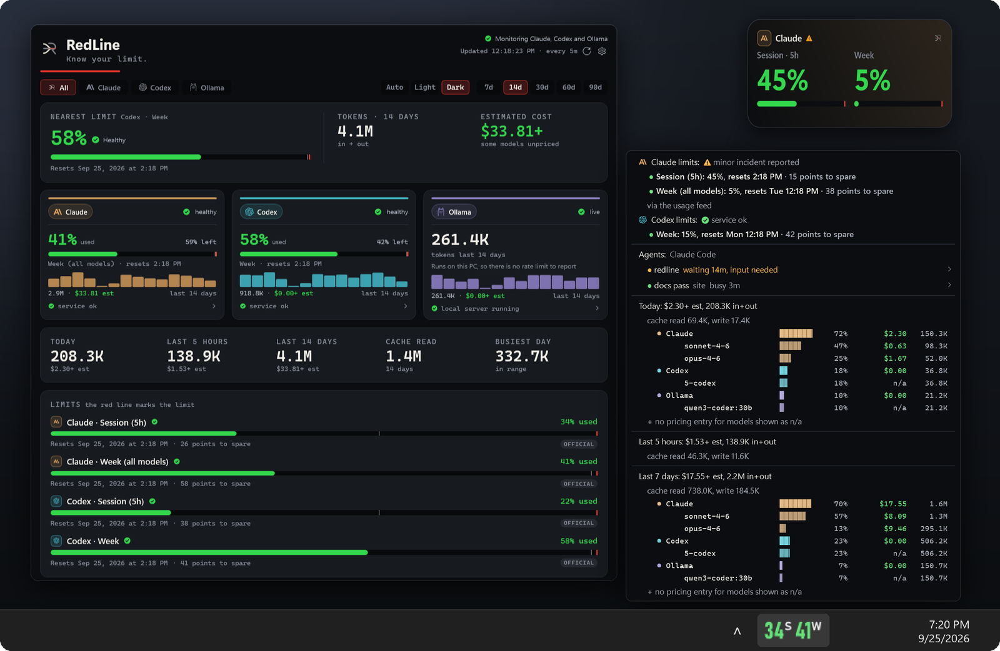
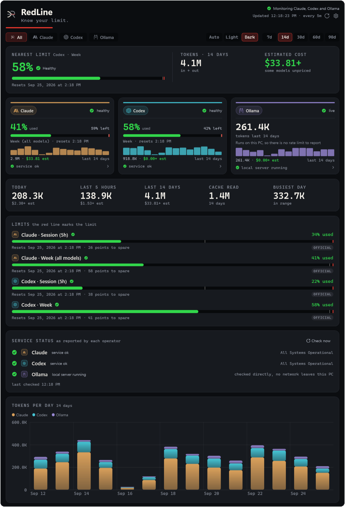
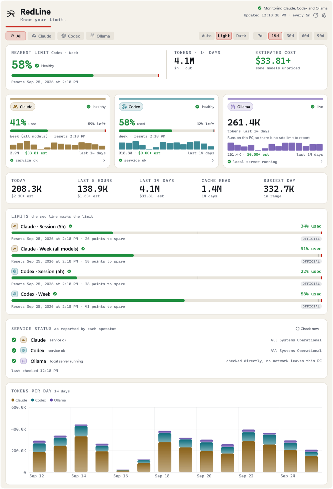
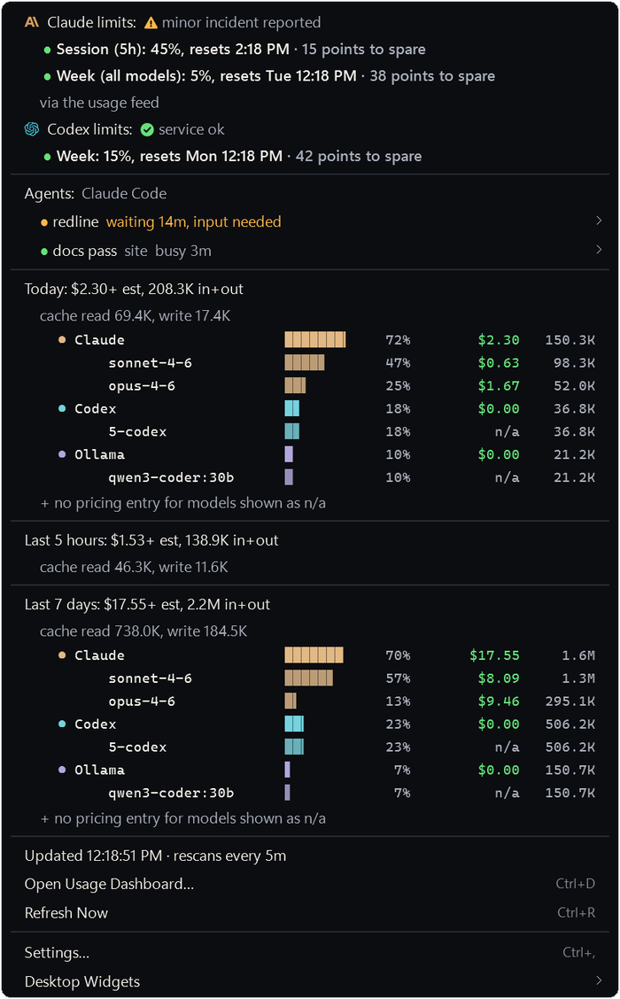
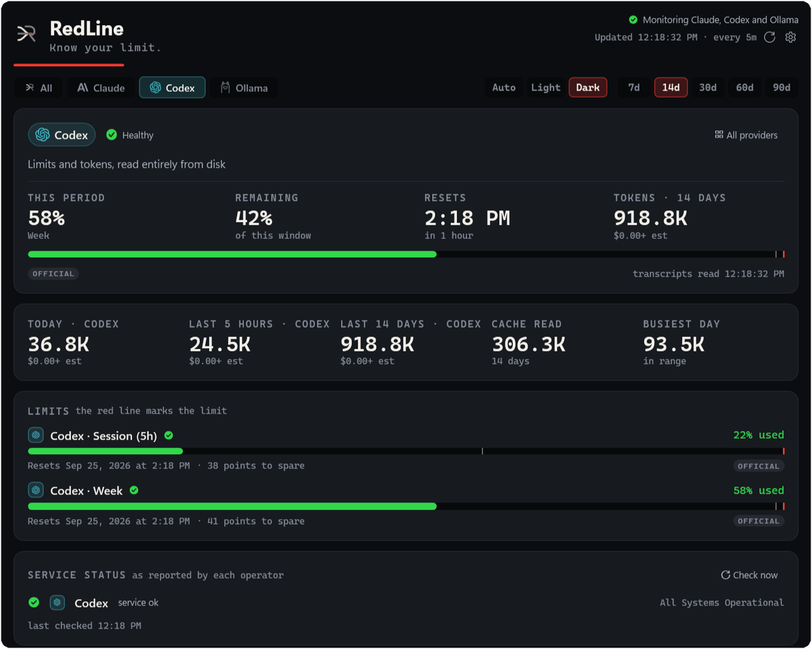
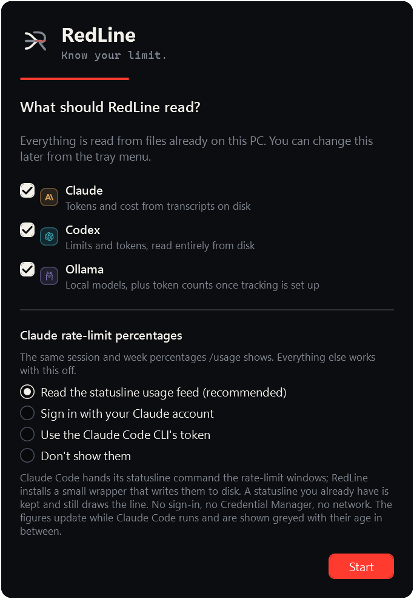
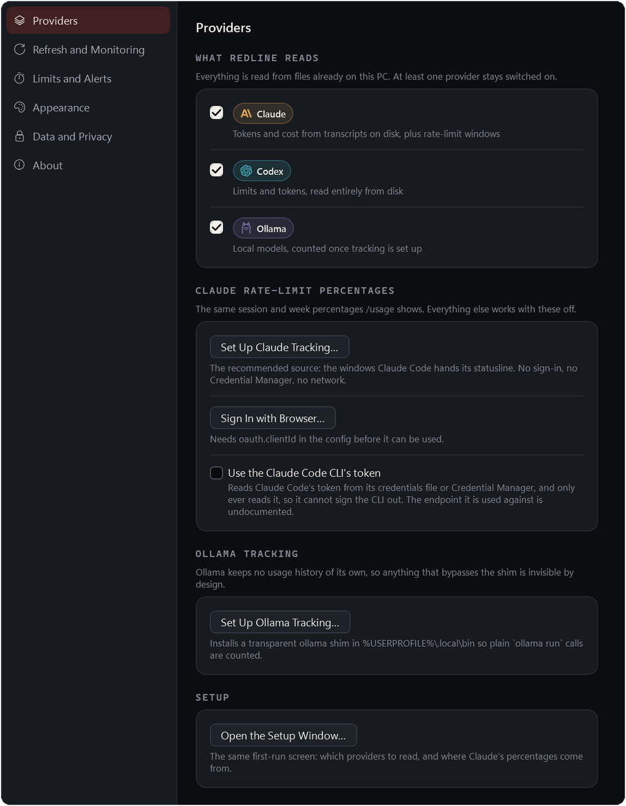
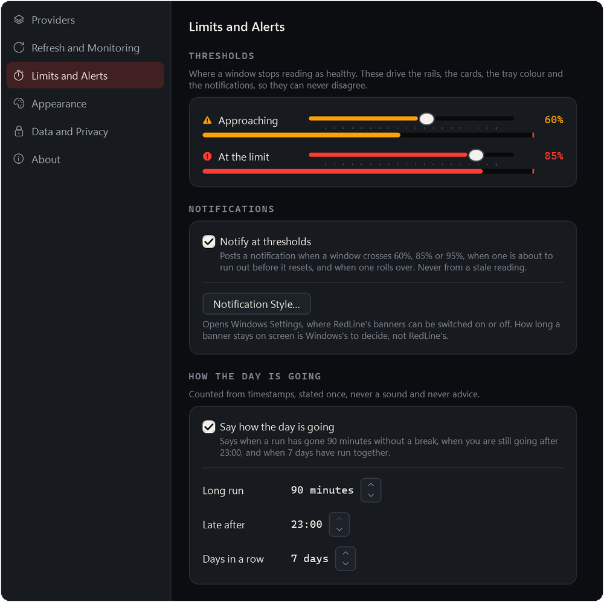
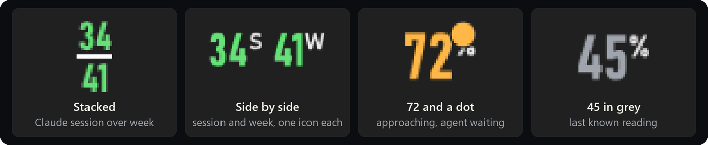
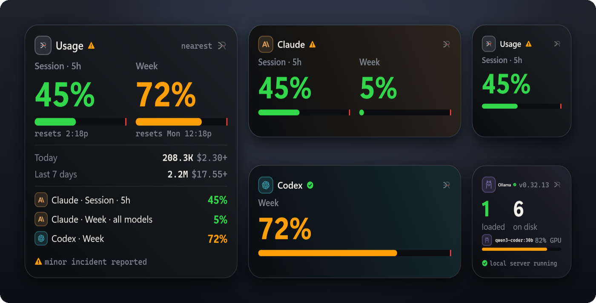

# RedLine for Windows

**Know your limit.** Claude, Codex and Ollama usage in the Windows notification area.

<p align="center">

</p>

A C# / .NET 8 port of RedLine: the same usage monitor for Claude, Codex and Ollama, living in
the Windows notification area instead of the macOS menu bar. The top-level [README](../README.md)
describes what RedLine shows and why; everything there applies here unless this page says otherwise.

The Windows build is new. The macOS app has had more time in real use, so if a figure reads
wrong, [open an issue](https://github.com/goriparthi/redline/issues).

## Screenshots

| The dashboard, dark | The dashboard, light |
| :-: | :-: |
|  |  |

| The tray dropdown | One provider in detail |
| :-: | :-: |
|  |  |

The first run asks which providers to read and where Claude's percentages come from; settings
keep the same six sections as on macOS.

| First run | Settings, Providers | Settings, Limits and Alerts |
| :-: | :-: | :-: |
|  |  |  |

## Install

Needs Windows 10 or 11 (x64). No administrator rights.

### 1. The MSI (recommended)

Download `RedLine-<version>-x64.msi` from the [latest release](https://github.com/goriparthi/redline/releases/latest)
and double-click it. It installs for you alone into `%LOCALAPPDATA%\Programs\RedLine`, adds a Start
menu entry, and starts RedLine. Newer MSIs upgrade it in place, and so does **Install Update...**
in the tray, which fetches the next MSI, checks its `.sha256`, and runs it once RedLine has quit.

Remove it from **Settings > Apps > Installed apps**, or with **Uninstall RedLine...** in the tray.
Either way the sign-in entry, the saved token, the Claude Code statusline wiring and the Ollama
shim are undone first. Your settings and history stay unless you tick the option to delete them.

For scripted installs: `msiexec /i RedLine-<version>-x64.msi /qn` (add `LAUNCHAPP=0` to not start it).

### 2. The zip

`RedLine-<version>-win-x64.zip` holds the same files plus `install.ps1`, for anyone who would
rather not use Windows Installer:

```powershell
Get-FileHash -Algorithm SHA256 .\RedLine-0.8.5-win-x64.zip   # compare with the .sha256 file
Expand-Archive .\RedLine-0.8.5-win-x64.zip -DestinationPath .\RedLine
powershell -ExecutionPolicy Bypass -File .\RedLine\install.ps1
```

`install.ps1 -NoStartup` skips the sign-in entry and `-NoLaunch` skips starting it.
`uninstall.ps1` removes it again, and `-Purge` also deletes config, logs and history.

### 3. From source

Needs the .NET 8 SDK (`winget install Microsoft.DotNet.SDK.8`):

```powershell
git clone https://github.com/goriparthi/redline.git
cd redline\windows
.\scripts\build.ps1          # dist\: the MSI, the zip, a .sha256 for each, and the unpacked folder
.\scripts\install.ps1        # or double-click dist\RedLine-<version>-x64.msi
```

Until releases are code signed, Windows SmartScreen warns on first run ("Windows protected your PC"; **More info > Run anyway**). Building from source is the way to read what you run.

## What is different on Windows

The tray has no room for text, so the icon is the number. With a Claude session and week both in
play it stacks them, session over week, or gives each its own icon if you pick Side by side in Settings. Colour follows your thresholds, grey means the reading is
not live, and a dot means an agent is waiting on you.

<p align="center">

</p>

Desktop widgets are small borderless windows of RedLine's own, opened from **Desktop Widgets**
in the dropdown, in three sizes and any track:

<p align="center">

</p>

| macOS | Windows |
| --- | --- |
| Menu bar title with the percentage | Tray icon with the nearest limit's number drawn in it, full readout in the tooltip; left click opens the dropdown |
| Desktop widget (WidgetKit) | **Desktop Widgets** in the dropdown: small borderless windows showing the same snapshot, draggable, several at once, right click to change size and track |
| Keychain | Windows Credential Manager (target `redline`). Claude Code on Windows keeps its own credential in `%USERPROFILE%\.claude\.credentials.json`, read first and only with `useCLIToken` on |
| LaunchAgent | `HKCU\...\CurrentVersion\Run` value `RedLine` (`launchAtLogin` in config) |
| `claude-statusline.sh` | `redlinectl.exe statusline`; an existing statusline command is kept and chained through `~\.local\share\redline\claude-statusline.cmd` |
| `~/.local/bin/ollama` shim | `%USERPROFILE%\.local\bin\ollama.cmd`, put at the front of your user PATH. New terminals only; an `ollama.exe` on the machine PATH wins over it and the installer warns |
| Terminal tab focus via tty | Brings the terminal window forward (Windows Terminal, VS Code, conhost); tabs cannot be targeted |
| Notifications | Tray balloon notifications; style is set in Settings > System > Notifications |
| Notarized DMG, in-place update | Per-user MSI (or zip) plus `.sha256`, downloaded only from this repo's releases, hash verified, and the signer checked when the running build is signed |
| Full Disk Access | Not needed; dropped |

Paths match macOS relative to your profile, so docs and other tools line up:
`%USERPROFILE%\.config\redline\config.json`, `%USERPROFILE%\.local\share\redline\`
(snapshot, usage sidecar, feed, history database, diagnostics). Two config keys are
Windows only: `launchAtLogin`, and `trayLayout` (`stacked` puts Claude's session over its week in
one tray icon, `split` gives each its own icon).

## Command line

`redlinectl.exe` sits next to `RedLine.exe` in `%LOCALAPPDATA%\Programs\RedLine`:

```powershell
redlinectl status              # windows, pace, today and this week
redlinectl status --json
redlinectl findings --days 14
redlinectl history --csv
redlinectl cadence
redlinectl ingest
redlinectl log --tally
```

Exit codes match macOS: `0` fine, `10` near a limit, `11` at a limit, `20` nothing to report, `30` no data.

## Development

```powershell
cd windows
dotnet build
dotnet test                    # core, app services and CLI suites
.\scripts\ci.ps1               # everything Windows CI runs
```

Layout and porting conventions are in [PORTING.md](PORTING.md). Debug builds carry render-to-PNG
samples for visual checks, for example `RedLine.exe --dashboard-sample --snapshot out.png`,
`--settings-sample`, `--firstrun-sample`, `--flyout-sample`, `--widget-sample`, `--tray-sample`
and `--gallery`. `REDLINE_HOME` works as on macOS, and a run under it never writes the login entry.
